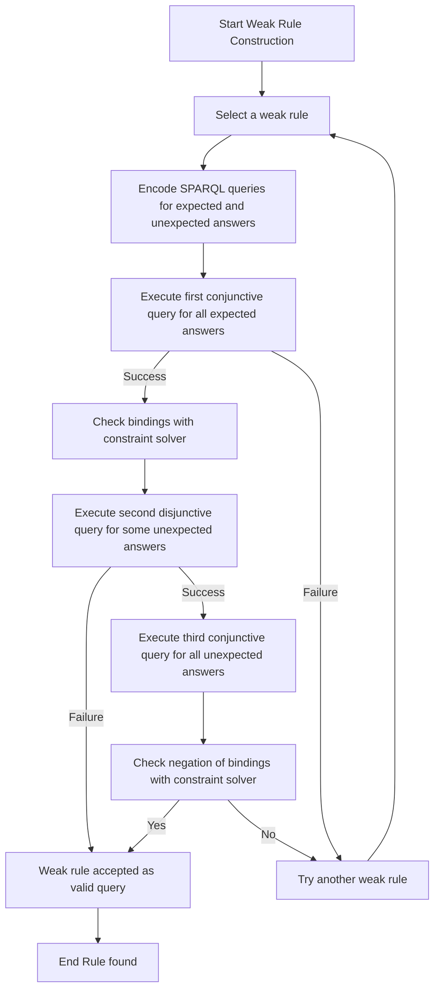

# Debugging of DBpedia SPARQL Queries

**University of Almería, 2025**

This repository contains the debugger for **DBpedia SPARQL queries**. The debugger aligns SPARQL queries with **expected and unexpected answers** by converting queries into rules and identifying query rewrites that satisfy these criteria. It uses **constraint solving** to determine filter conditions consistent with expected and unexpected results.

---

## Features

- **SWI-Prolog Implementation:** Core debugger implemented in Prolog (`dbprex.pl`).
- **Web Tool:** Interactive web interface available [here](https://github.com/jalmenUAL/debdb).
- **Web Tool Page:** Access the web tool online [here](http://dbt.ual.es/debdb).

---

## Debugging Process

The workflow of the debugger is illustrated in the following diagram:

### Step-by-Step Explanation

1. **Encoding of SPARQL**
   - Builds a rule r from a SPARQL q 

2. **Weak Rule Construction:**  
   - Build a set of weak rules `Weak(r)` and apply them to sets of expected and unexpected answers.

3. **SPARQL Encoding:**  
   - Each weak rule `wr` is encoded into three SPARQL queries:
     1. **Conjunctive query for expected answers**: Are all expected answers covered by `wr`?  
     2. **Disjunctive query for unexpected answers**: Does some unexpected answer match `wr`?  
     3. **Conjunctive query for unexpected answers**: Are all unexpected answers answers of `wr`?

4. **Execution & Constraint Solving:**  
   - **First query:** If success, obtain variable bindings and check satisfiability.  
   - **Second query:** If failure → accept rule; if success → execute third query.  
   - **Third query:** Check if negation of bindings is satisfiable. If yes → accept rule; else → try next weak rule.

5. **Iteration:**  
   - Repeat until a valid weak rule is found or all rules are tested.

## References

- [DBpedia](https://wiki.dbpedia.org/)  
- SWI-Prolog: [https://www.swi-prolog.org](https://www.swi-prolog.org)

---

## License

This project is released under the MIT License.
